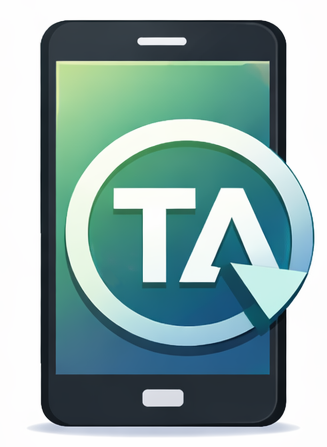
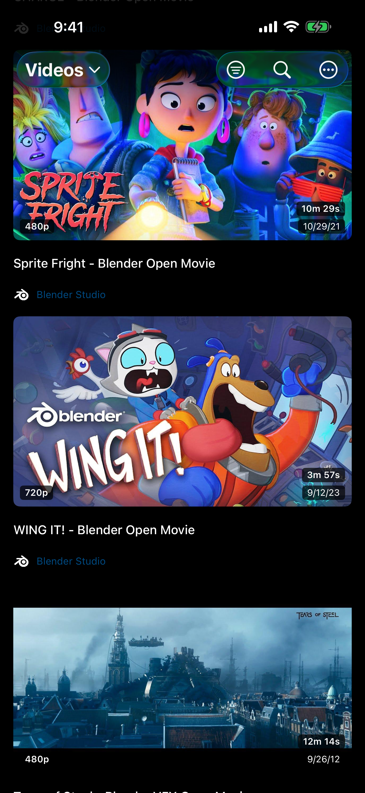
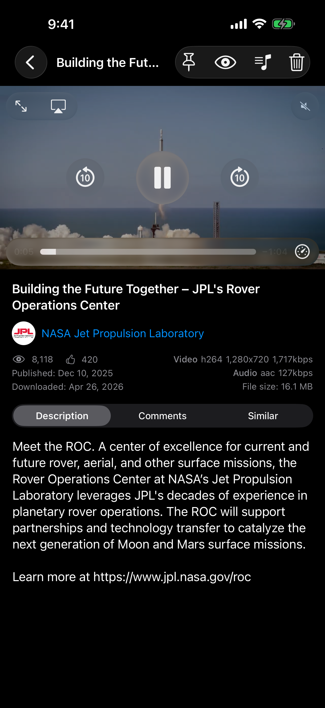
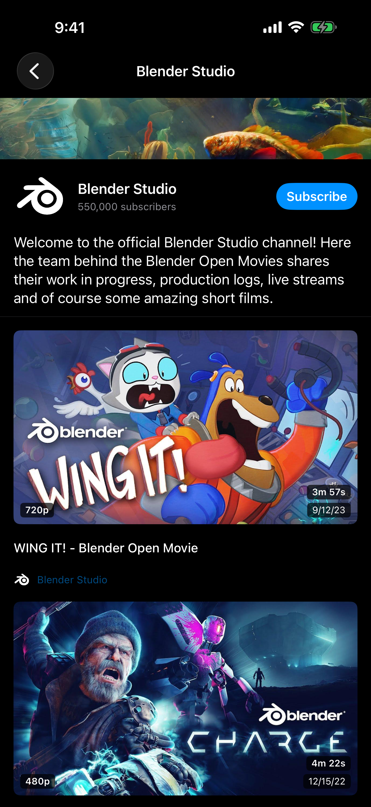
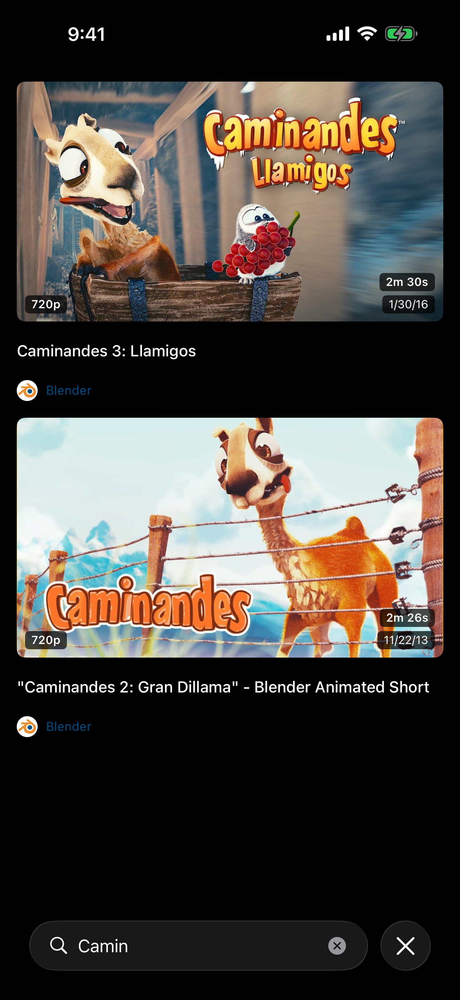
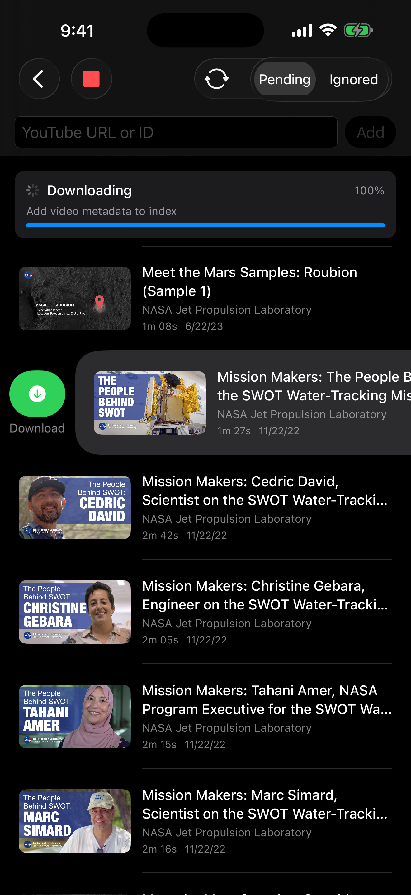

<p align="center">
  
</p>

<h1 align="center">TA Client</h1>

<p align="center">
  A native iOS and iPadOS client for <a href="https://github.com/tubearchivist/tubearchivist">Tube Archivist</a> — your self-hosted YouTube media archive.
</p>

<p align="center">
  
  
  
</p>

---

## Try it on your device — TestFlight beta

TA Client is currently in public beta on Apple TestFlight. Anyone with an iPhone or iPad can install the latest build directly:

> **[Join the TestFlight beta →](https://testflight.apple.com/join/V4wHhJSN)**

How to install:

1. Make sure the [TestFlight app](https://apps.apple.com/app/testflight/id899247664) from Apple is installed on your iPhone or iPad
2. Tap the link above on your device
3. Tap **Accept**, then **Install**

Beta builds expire 90 days after upload; if your installed copy stops launching, return to TestFlight and update to the newest build. If you find a bug, please file it as a [GitHub issue](https://github.com/MikhailZhukov/TAClient/issues) or use TestFlight's built-in feedback (shake the device or take a screenshot in the app).

If you prefer to build from source, see [Building](#building) below.

---

## Screenshots

<!-- TODO: add screenshots once captured. Suggested layout:
<div style="width:100%; display:flex; gap:8px;">

[](docs/screenshots/iphone_library.png)
[](docs/screenshots/iphone_player.png)
[](docs/screenshots/iphone_channel.png)
[](docs/screenshots/iphone_search.png)
[](docs/screenshots/iphone_downloads.png)

</div>
-->

## Why TA Client

Tube Archivist is excellent at archiving your YouTube library on a server you control, but its web UI is built for desktop browsers. TA Client gives you a native iOS experience that respects Apple's Human Interface Guidelines: Dynamic Type, Dark Mode, full VoiceOver labels, lock-screen playback, and AirPlay routing all work the way iPhone and iPad users expect.

## Features

- Browse your library with sort, filter by video type (videos / shorts / streams), and watch-state filter
- Search across the full archive
- Channel pages with banner, description, subscribe toggle, and video grid
- Threaded comment viewing
- Playlists — both regular YouTube playlists and custom user-created ones
- Multi-select batch operations (mark watched / unwatched, delete)
- Hardware-accelerated playback for **H.264 / H.265 / AV1** via native AVPlayer
- **VP8 / VP9** support via VLC fallback (auto-selected per video codec)
- In-memory video cache with sliding window for smooth seeking on slow servers
- Watch-progress sync — every 10 seconds, plus on pause and on completion
- **SponsorBlock** — automatic skip of sponsor segments with per-category toggles and undo
- Background audio + lock-screen controls (play / pause / skip / seek / artwork)
- AirPlay routing
- **Share Extension** — add YouTube videos to the download queue from any Share sheet
- Download queue management — add, prioritize, ignore, delete, kick off downloads
- Privilege-aware UI — admin actions hidden for non-admin users
- Full iPad support, all orientations, Stage Manager / Split View
- Localization: English and Russian

## Requirements

- iOS / iPadOS 17.0 or later
- Xcode 26.2 or later
- A running [Tube Archivist](https://github.com/tubearchivist/tubearchivist) server you can reach from your device

## Building

1. Clone the repository:
   ```bash
   git clone https://github.com/YOUR_USERNAME/TAClient.git
   cd TAClient
   ```

2. Open `TAClient.xcodeproj` in Xcode. Swift Package Manager will fetch [`MobileVLCKit-SPM`](https://github.com/MobileVLCKit-SPM/MobileVLCKit-SPM) on first open — this is the LGPL-licensed VLC binding required for VP9 playback.

3. Update the signing settings for **both** targets (`TAClient` and `ShareExtension`):
   - Select the target → **Signing & Capabilities**
   - Set your **Team**
   - Change the **Bundle Identifier** from `ru.mzhukov.TAClient` to your own (e.g. `com.yourname.TAClient`); the Share Extension must match the same prefix (e.g. `com.yourname.TAClient.ShareExtension`)
   - In `TAClient/TAClient.entitlements` and `ShareExtension/ShareExtension.entitlements`, replace the keychain access group `5AS4WKH94K.ru.mzhukov.TAClient` with `<YOUR_TEAM_ID>.<your.bundle.id>` — both files must use the same group, otherwise the Share Extension cannot read credentials saved by the main app

4. Build and run on a simulator or device.

### Command-line build

```bash
xcodebuild build -scheme TAClient -destination "platform=iOS Simulator,name=iPhone 17 Pro"
```

## First Run

1. Launch the app — you will see the login screen.
2. Enter:
   - **Server URL** — the full URL of your Tube Archivist server (e.g. `https://ta.example.com` or `http://192.168.1.10:8000`)
   - **Username** and **Password** — your Tube Archivist credentials
3. Tap **Sign In**. The app authenticates against your server, retrieves an API token, and stores it in the iOS Keychain. Subsequent launches sign you in automatically.

If your server uses a self-signed certificate or plain HTTP on a local network, this works out of the box — App Transport Security is configured to allow user-provided URLs.

## AI Attribution

The majority of this project was built collaboratively with [Claude Code](https://claude.com/claude-code) (Anthropic).

The app icon was generated with ChatGPT (OpenAI).

## Acknowledgements

- [Tube Archivist](https://github.com/tubearchivist/tubearchivist) — the server that makes this client possible
- [MobileVLCKit-SPM](https://github.com/MobileVLCKit-SPM/MobileVLCKit-SPM) — VP9 playback (LGPL-2.1-or-later)
- [SponsorBlock](https://sponsor.ajay.app/) — community-maintained sponsor segment data, served by your TA instance

This project is **not** affiliated with Tube Archivist. Please do not file TA Client issues in the Tube Archivist repository.

## License

Copyright © 2026 Mikhail Zhukov.

TA Client is licensed under the **Apache License, Version 2.0**. See the [LICENSE](LICENSE) file for the full license text and the [NOTICE](NOTICE) file for attribution requirements.

You are free to use, modify, and redistribute this software, including in commercial and proprietary projects, subject to the conditions of the Apache-2.0 license (preserve the license text, copyright notices, and the NOTICE file).

The bundled MobileVLCKit framework is a separate work licensed under LGPL-2.1-or-later by VideoLAN — see [NOTICE](NOTICE) for details and a link to its source.
